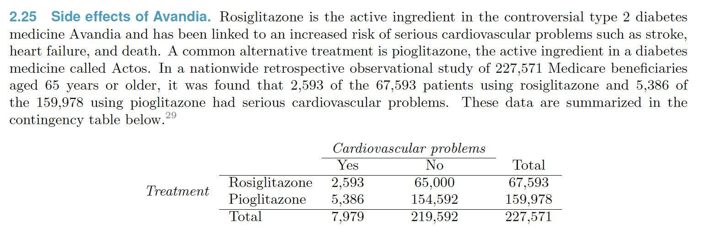
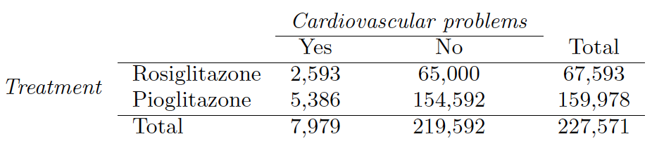
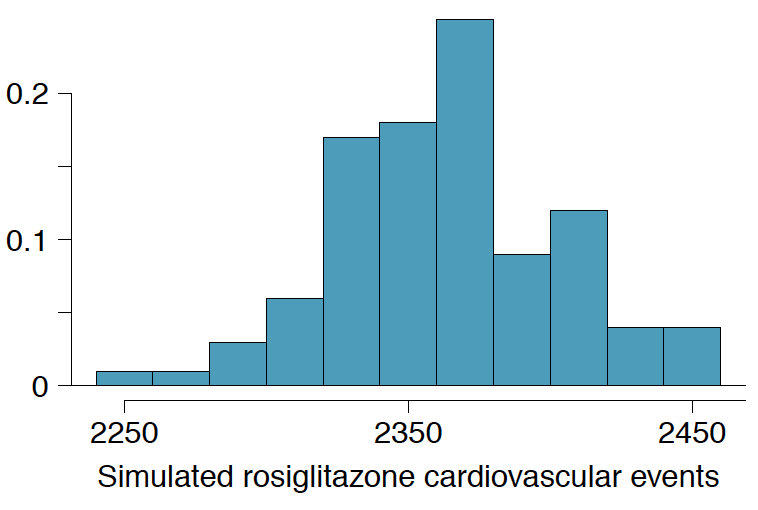

```{r setup, include=FALSE, echo=FALSE}
knitr::opts_chunk$set(echo = TRUE)
library(viridis)
```

## Problem
Source files: [https://github.com/djlofland/DATA606_F2019/tree/master/Presentation]



**References**:

- D.J. Graham et al. Risk of acute myocardial infarction, stroke, heart failure, and death in elderly Medicare patients treated with rosiglitazone or pioglitazone". In: *JAMA* 304.4 (2010), p. 411. issn: 0098-7484.


```{r echo=FALSE}
library(formattable)
```

## Part (a)



Determine if each of the following statements is true or false. If false, explain why. Be careful: The reasoning may be wrong even if the statement's conclusion is correct. In such cases, the statement should be considered false.

> Since more patients on pioglitazone had cardiovascular problems (5,386 vs. 2,593), we can conclude that the rate of cardiovascular problems for those on a pioglitazone treatment is higher.

>- **FALSE.** We cannot draw conclusions from the raw counts since these do not take into account sample sizes.

## Part (a)


Determine if each of the following statements is true or false. If false, explain why. Be careful: The reasoning may be wrong even if the statement's conclusion is correct. In such cases, the statement should be considered false.

> The data suggest that diabetic patients who are taking rosiglitazone are more likely to have cardiovascular problems since the rate of incidence was (2,593 / 67,593 = 0.038) 3.8% for patients on this treatment, while it was only (5,386 / 159,978 = 0.034) 3.4% for patients on pioglitazone.

>- **FALSE.** While the rate is higher (3.8% vs 3.4%) we do not know yet if this difference is due to chance. It might be higher but we cannot conclude this yet.

## Part (a)


Determine if each of the following statements is true or false. If false, explain why. Be careful: The reasoning may be wrong even if the statement's conclusion is correct. In such cases, the statement should be considered false.

> The fact that the rate of incidence is higher for the rosiglitazone group proves that rosiglitazone causes serious cardiovascular problems.

>- **FALSE.** We have not established any causal links yet.  The difference could be chance or related to some other factor we haven't considered.

## Part (a)


Determine if each of the following statements is true or false. If false, explain why. Be careful: The reasoning may be wrong even if the statement's conclusion is correct. In such cases, the statement should be considered false.

> Based on the information provided so far, we cannot tell if the difference between the rates of incidences is due to a relationship between the two variables or due to chance.

>- **TRUE.**

## Part (b)


> What proportion of all patients had cardiovascular problems?

```{r echo=TRUE}
cario_all_portion <- 7979/227571
cario_all_percent <- formattable::percent(cario_all_portion, 2)
```

>- **`r cario_all_percent`** of all patients had cardiovascular problems.

## Part (c)


> If the type of treatment and having cardiovascular problems were independent, about how many patients in the rosiglitazone group would we expect to have had cardiovascular problems?

```{r}
ros_total <- 67593
cario_count <- 7979
total_count <- 227571
ros_cardio_count <- round(cario_count/total_count * ros_total, 0)
```

>- If type of treatment and cardiovascualr problems are independent, then we would expect to see approximately **`r ros_cardio_count`** patients in the rosiglitazone group with cardiovascualr problems.

## Part (d)

We can investigate the relationship between outcome and treatment in this study using a randomization technique. While in reality we would carry out the simulations required for randomization using statistical software, suppose we actually simulate using index cards. In order to simulate from the independence model, which states that the outcomes were independent of the treatment, we write whether or not each patient had a cardiovascular problem on cards, shuffled all the cards together, then deal them into two groups of size 67,593 and 159,978. We repeat this simulation 1,000 times and each time record the number of people in the rosiglitazone group who had cardiovascular problems. Use the relative frequency histogram of these counts to answer (i)-(iii).

```{r, out.width = "300px", echo=FALSE}

```

> What are the claims being tested?

>- H<sub>0</sub>: Independence model where the **treatment and outcome are independent** and the treatment had no influence on the outcome.  I.e. Rosiglitazone has no effect on cardiovascular problem.

>- H<sub>A</sub>: Aleternate Model where the variables are **not** independent and the treatment affected the outcome, i.e. the **outcome was dependent on the presence of the treatment**. I.e. Rosiglitazone has an effect on cardiovascular problem.

## Part (d)

We can investigate the relationship between outcome and treatment in this study using a randomization technique. While in reality we would carry out the simulations required for randomization using statistical software, suppose we actually simulate using index cards. In order to simulate from the independence model, which states that the outcomes were independent of the treatment, we write whether or not each patient had a cardiovascular problem on cards, shuffled all the cards together, then deal them into two groups of size 67,593 and 159,978. We repeat this simulation 1,000 times and each time record the number of people in the rosiglitazone group who had cardiovascular problems. Use the relative frequency histogram of these counts to answer (i)-(iii).

```{r, out.width = "300px", echo=FALSE}

```

> Compared to the number calculated in part (b), which would provide more support for the alternative hypothesis, more or fewer patients with cardiovascular problems in the rosiglitazone group?

>- **more.** We observed 2593 in the study.  Based on the simulation, assuming the Independence Model, we would have expected to see ~2350 patients.  2593 is at the far end of the right tail, suggesting it was not due to chance.  *Fewer* patients with cariodvascular effects would increase our likilhood of accepting the H<sub>0</sub> Independence Model.  

## Part (d)

We can investigate the relationship between outcome and treatment in this study using a randomization technique. While in reality we would carry out the simulations required for randomization using statistical software, suppose we actually simulate using index cards. In order to simulate from the independence model, which states that the outcomes were independent of the treatment, we write whether or not each patient had a cardiovascular problem on cards, shuffled all the cards together, then deal them into two groups of size 67,593 and 159,978. We repeat this simulation 1,000 times and each time record the number of people in the rosiglitazone group who had cardiovascular problems. Use the relative frequency histogram of these counts to answer (i)-(iii).

```{r, out.width = "300px", echo=FALSE}

```

> What do the simulation results suggest about the relationship between taking rosiglitazone and having cardiovascular problems in  diabetic patients?

>- The simulation suggest that the treatment effects seen in the rosiglitazone are **not likely due to chance**.

## The End

Thank you. Donny Lofland

Presentation files: [https://github.com/djlofland/DATA606_F2019/tree/master/Presentation]

**References**:

- D.J. Graham et al. Risk of acute myocardial infarction, stroke, heart failure, and death in elderly Medicare patients treated with rosiglitazone or pioglitazone". In: *JAMA* 304.4 (2010), p. 411. issn: 0098-7484.